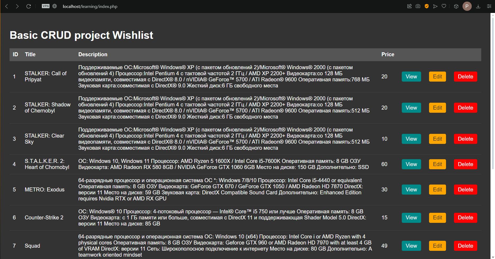
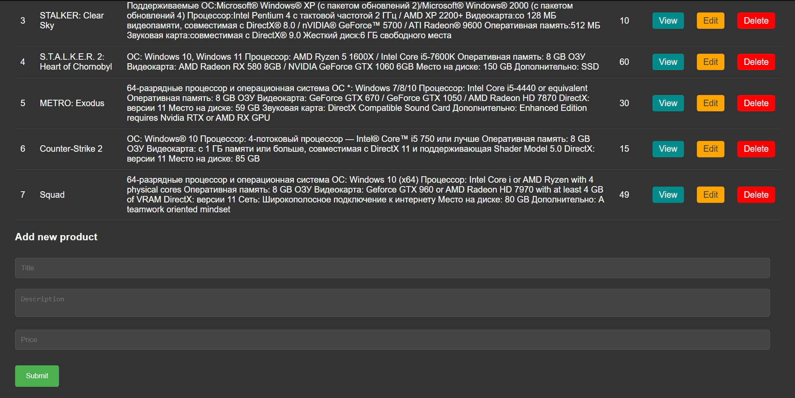
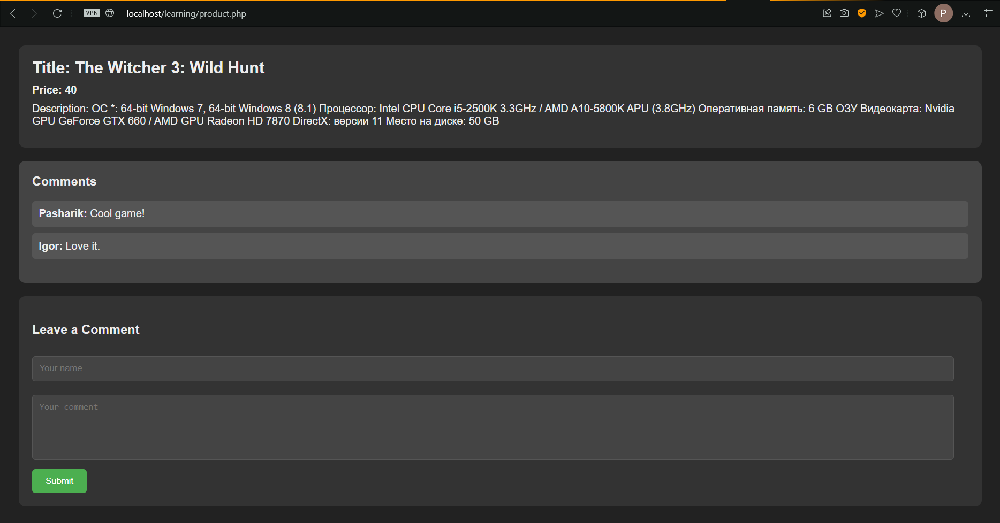
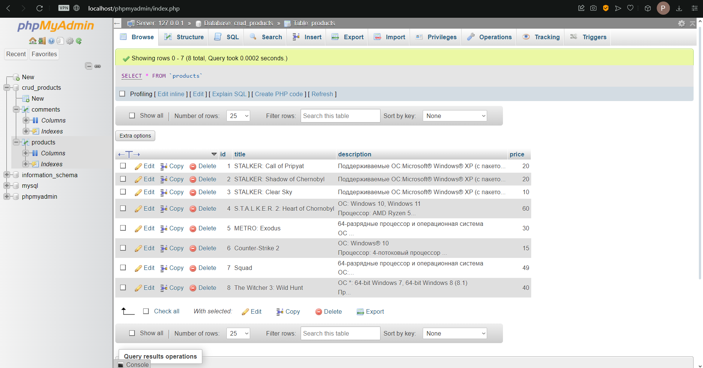
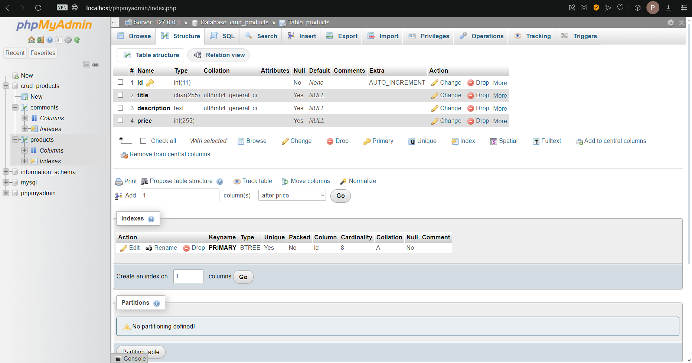
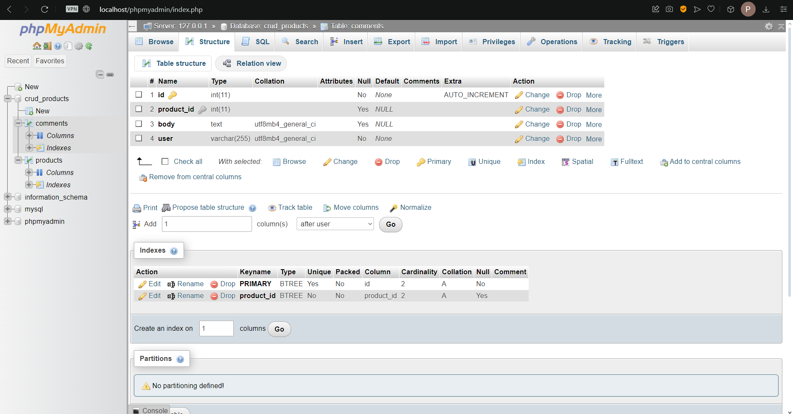

# **CRUD_Wishlist**

My pet project "Wishlist" operates on a CRUD (Create, Read, Update, Delete) principle, allowing users to manage items in their wishlist. Users can view existing comments and leave their own feedback. The program connects to the database MySQL directly, without using [PDO](https://www.php.net/manual/en/class.pdo.php), which requires the implementation of SQL query validation.

## **Features**

- **CRUD Operations:** Manage items on your wishlist with Create, Read, Update, and Delete functionalities.
  
- **Comment System:** View and leave comments on each wishlist item, allowing for user feedback and interaction.

- **User-Friendly Interface:** Wishlist has a pleasant and intuitive user interface.

## **Interface**

**Main Page Interface (1)**

**Main Page Interface (2)**

**Product Page with Information and Comments (3)**

**Products Stored in MySQL Database (4)**

**Products Table Structure (5)**

**Comments Table Structure (6)**

## **Usage**

### 1. Main Page
- **View All Products**: The main page displays a list of all products in your wishlist. Each product shows its title, price, and a brief description.

### 2. Viewing a Product
- **Product Details**: Click the "View" button on a product to see detailed information, including the full description, price, and any comments left by users.
- **Leave a Comment**: At the bottom of the product page, there is a form to leave a comment. Enter your name and comment, then submit it to add your feedback.

### 3. Adding a Product
- **Add New Product**: Navigate to the "Add Product" page, fill in the details for the new product (title, description, price), and submit the form to add it to your wishlist.

### 4. Editing a Product
- **Edit Product Details**: On the product page, click the "Edit" button to update the product's details. Make your changes and save them to update the product information.

### 5. Deleting a Product
- **Remove a Product**: On the product page, click the "Delete" button to remove the product from your wishlist. Confirm the deletion to permanently remove the product.

### 6. Managing Comments
- **View Comments**: All comments related to a product are displayed on its product page.
- **Add a Comment**: Use the comment form on the product page to leave feedback.
- **Delete a Comment**: If necessary, comments can be deleted by clicking the "Delete" button next to the comment.

### 7. Database Management
- **MySQL Database**: The project uses a MySQL database to store product and comment data. Ensure your database connection is properly configured in the `config/connect.php` file.
- **Tables Structure**: The `products` table stores product details, while the `comments` table stores user comments associated with products.

### 8. Security Measures
- **SQL Injection Prevention**: Ensure that SQL query validation is implemented to protect against SQL injection attacks. Use prepared statements and input sanitization where applicable.

By following these steps, you can effectively manage your wishlist, view detailed product information, and interact with the comment system. Make sure to configure your database settings and implement security measures to keep your data safe.

## **Requirements**
Make sure you have [XAMPP](https://www.apachefriends.org/download.html) and [VS code](https://code.visualstudio.com/download).

**This project was tested in the environments listed below:**

- XAMPP Control Panel v3.3.0
- Apache 8.2.12
- PHP 8.3.8
- MySQL 8.4.0
- VS code
- Windows 11

## **Contributing**

If you'd like to contribute to Wishlist, feel free to open an issue or submit a pull request on the [GitHub repository](https://github.com/PashaKryvulets/CRUD_Wishlist).

## **License**

Wishlist is released under the [MIT License](LICENSE).
